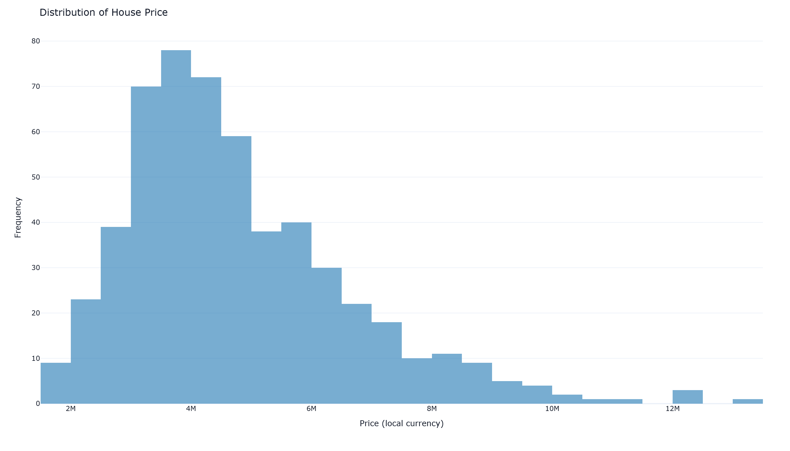
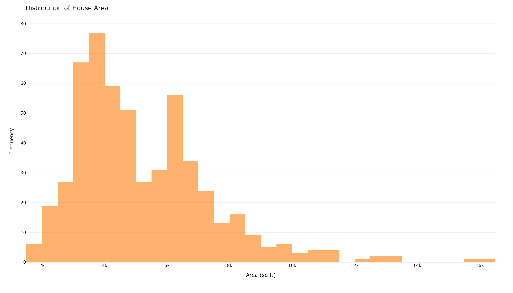

## 执行摘要
本次分析旨在利用房产数据集，通过描述性统计、相关性分析、机器学习建模与可视化手段，揭示影响房屋价格的关键因素与分布特征。核心发现表明，房屋面积与价格呈显著正相关（皮尔逊系数0.54），随机森林模型对价格的预测误差约为158万元。此外，价格呈右偏分布，多数房屋集中于中低价位，为后续定价、市场细分与投资决策提供了量化依据。

## 数据概览
数据集包含545条房屋记录，共计13个字段。目标变量为 `price`（房屋售价），其余12个特征涵盖：
- 数值型特征（已标准化）：`area`、`bedrooms`、`bathrooms`、`stories`、`parking`
- 二元分类型特征（0/1）：`mainroad`、`guestroom`、`basement`、`hotwaterheating`、`airconditioning`、`prefarea`
- 有序分类型特征：`furnishingstatus`（装修程度，0-无装修，1-半装修，2-全装修）

数据已完成清洗，无缺失值，且数值特征经过标准化处理，消除了量纲差异，可直接用于建模。

## 详细分析
### 数据预处理
原始数据中的分类变量需转换为数值形式以便建模。具体操作如下：
- 二元特征（如是否临主路、是否有客房）映射为0/1。
- 装修状态进行有序编码，数值越高表示装修越完备。
- 五个数值特征进行标准化，使其均值为0、标准差为1，避免量级差异影响模型。
- 目标变量 `price` 保留原始尺度，便于直接解读。
预处理后数据集无缺失，可直接用于后续分析。

### 统计分析
针对房屋面积与价格的线性关系进行皮尔逊相关检验。结果显示：
- 相关系数 r = 0.536，p 值 < 0.001。
- 统计显著性极强，表明面积越大，售价显著越高的趋势十分可靠。
- 面积约为价格的正向主导因子之一，可用于初步价格预估。

### 机器学习
采用随机森林回归器（100棵决策树）构建预测模型，将数据按80/20划分训练集与测试集。模型在测试集上的表现如下：
- 平均绝对误差（MAE）：约113.1万
- 均方根误差（RMSE）：约158.2万

考虑到房价本身量级可达千万，该误差水平处于可接受范围。随机森林可自动捕捉特征间的非线性关系与交互作用，为更精准的估值提供基础。

### 数据可视化
通过对价格与面积绘制直方图，观察到：
- 价格分布明显右偏，多数房屋售价集中在600万至1200万区间，少数高价房屋拉长了右侧尾部。
- 面积分布相对集中，但也呈现一定的右偏形态，与价格分布趋势相呼应。
- 标准化后的面积分布依然可见原始数据偏态特征，为中位数参考和异常值识别提供直观依据。

## 关键发现
1. **面积是驱动房价的关键因素**：面积与价格之间存在显著强正相关，每增加一个标准化单位的面积，价格倾向显著上升。
2. **房价分布右偏，存在高端市场机会**：多数房产位于中低价位带，高价房产虽少但拉升了整体均值，高端细分市场有潜力空间。
3. **随机森林模型具备中等预测精度**：RMSE约158万元，可用于快速估价或辅助定价，但仍有优化空间，建议引入更多区位、经济指标等特征。
4. **装修程度、停车位等设施影响隐而未显**：模型未单独输出特征重要性，未来可进一步分析诸如热水供应、空调、停车位等特征对价格的边际贡献。
5. **数据质量良好**：无缺失值且标准化处理完善，确保统计结论与模型结果的可靠性。

## 结论与建议
本次分析确认房屋面积是影响售价的核心变量，且数据整体质量良好，适合用于构建价格预测工具。基于此，提出以下建议：
- **定价策略**：房地产开发商或中介可将面积作为基准定价的起点，叠加地段、设施等因子形成差异化定价矩阵。
- **模型优化**：当前随机森林模型可进一步通过特征工程（如添加区域均价、距离市中心远近等）和超参数调优来降低预测误差。
- **市场洞察**：价格右偏提示中高端市场需求未饱和，可针对大面积、精装修房源制定专项营销方案。
- **持续监控**：建议定期更新数据并重训模型，以反映市场动态变化的趋势。

## 可视化图表

### 图 1

### 图 2

